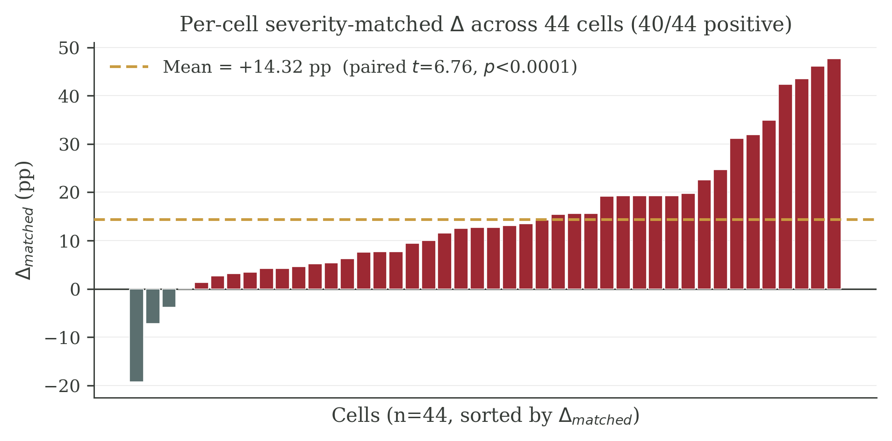
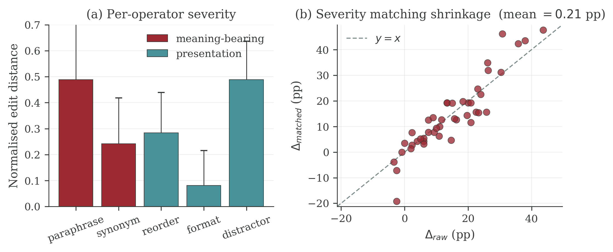
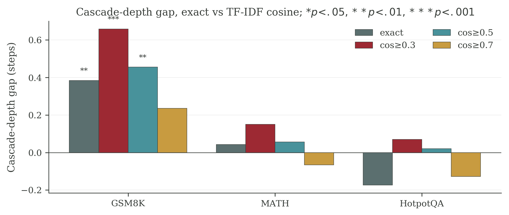
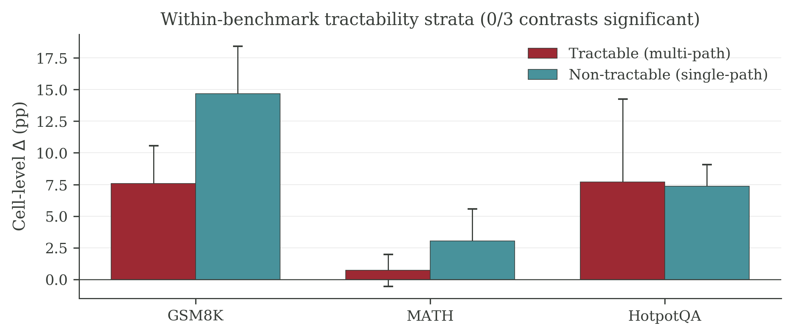
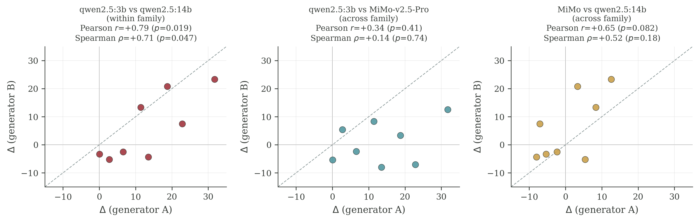

# When Do LLM Agents Treat Surface Noise Differently from Semantic Noise? A 44-Cell Measurement Study with Severity, Generator, and Judge Robustness Tests

## Abstract

We document an empirical phenomenon in chain-of-thought and ReAct agents driven by six large language models drawn from three architecture families: when an input is perturbed by a meaning-bearing operator (paraphrase, synonym), the agent's final answer changes more often than when it is perturbed by a presentation operator (reordering, formatting, distractor) of comparable severity. Across 44 cells covering three benchmarks (GSM8K, MATH, HotpotQA), 970 originals and 8,350 variants, the inconsistency rate gap averages +14.32 pp after severity matching (paired t=6.76, p<0.0001; 40/44 positive; Table 1, Figure 1). The gap survives a four-way severity-proxy audit — edit distance, token Jaccard, Sentence-BERT cosine on 768-d embeddings, and length-change ratio — with matched Δ between +13.7 and +15.4 pp at p<0.0001 throughout (Table 1b). The gap correlates with task accuracy (Pearson r=+0.44, BH q=0.021), and on GSM8K shows a +0.38 step cascade depth gap (p=0.007) that survives a TF-IDF cosine redefinition (+0.66 step, p<0.001; Figure 3). On the 24 non-qwen cells alone the gap remains +5.54 pp (paired t=4.41, p=0.0002), so the phenomenon is not a single-family artefact, although the effect size halves outside qwen. The phenomenon fails several stress tests: wild cluster bootstrap on the regression coefficient is non-significant at K=6 model clusters (p=0.165) and at K=3 family clusters (p=0.241); within-benchmark tractability proxies show 0/3 significant contrasts (§4.5); a cross-architecture generator swap destroys per-cell ranking (Spearman ρ=+0.14) while the within-architecture swap preserves it (ρ=+0.71; Figure 5); and a second LLM judge agrees at Cohen's κ=0.50. We position this as a measurement contribution: a stable directional gap that is robust to severity definition and to family-level subsampling, with explicit boundaries on what mechanism the current data can and cannot identify.

## 1. Introduction

Large language model agents that solve multi-step reasoning, math, and retrieval tasks are increasingly deployed in settings where input prompts are paraphrased by upstream models, reordered by templating systems, or perturbed by adversaries. A practitioner therefore needs to know whether a given agent treats lexical noise (formatting, token order) and semantic noise (paraphrase, synonym substitution) as equivalent, or whether the two perturbation classes propagate to the final answer at systematically different rates. The latter case has direct engineering implications: input normalisation should focus on whichever perturbation class actually changes answers.

Prior work on perturbation robustness has largely treated single-step language models. Zhu et al. (2024) report that prompt rewrites of various flavours degrade accuracy, but PromptBench does not separate out a directional gap between meaning-bearing and presentation perturbations, and it does not study multi-step agent trajectories. Ribeiro et al. (2020) introduced behavioural categories with CheckList but operate on classifiers, not agents with tool use and retrieval. Recent agent benchmarks such as AgentBench (Liu et al., 2024) measure raw success rate, not perturbation sensitivity. Sclar et al. (2024) showed that prompt formatting alone can shift accuracy by tens of points, motivating the question of whether agents inherit this fragility. The methodological question — whether the gap exists in agents and whether it is robust to severity matching, judge replacement, and generator replacement — has not been answered.

We address that question with a 44-cell measurement study covering six LLMs from three architecture families (qwen2.5 3B/7B; llama-3.2 1B/3B and llama-3.1 8B; MiMo-v2.5-Pro), three benchmarks (GSM8K, Cobbe et al., 2021; MATH, Hendrycks et al., 2021; HotpotQA, Yang et al., 2018), and two scaffolds (chain-of-thought, Wei et al., 2022; ReAct, Yao et al., 2023). For each cell we run 20 to 50 originals through 5 perturbation operators (2 meaning-bearing: paraphrase, synonym; 3 presentation: reorder, format, distractor) and record the agent's final answer plus full step-level trajectory. We then submit the resulting data to a sequence of stress tests: severity matching by edit-distance and Sentence-BERT cosine bins, wild cluster bootstrap (Cameron et al., 2008; Roodman et al., 2019) at both K=6 model and K=3 family levels, hierarchical bootstrap for nested trajectory data, generator-swap with two alternative perturbation generators, and second-judge cross-validation with a different LLM family (Zheng et al., 2023). Closest prior work measuring perturbation effects on multi-step reasoning is Mirzadeh et al. (2024) on GSM-Symbolic; we situate our results against it explicitly in §2 and §6.

Our contributions are:

1. **A directional inconsistency gap that is robust across four severity definitions and survives family-level subsampling.** After matching meaning-bearing and presentation operators on edit-distance distribution, the cell-level gap is $+14.32$ pp (paired $t=6.76$, $p<0.0001$; 40/44 positive). The gap stays in the $+13.7$ to $+15.4$ pp range when severity is alternatively defined by token Jaccard distance, Sentence-BERT (768-d nomic-embed-text) cosine distance, or absolute length-change ratio, with $p<0.0001$ for every proxy (§4.1, Table 1b). Restricted to the 24 non-qwen cells alone, it remains $+5.54$ pp (paired $t=4.41$, $p=0.0002$). The GSM8K cascade-depth gap survives a TF-IDF cosine redefinition (gap $+0.66$ steps, $p<0.001$).
2. **An honest boundary on small-cluster identification.** Wild cluster bootstrap with $K=6$ model clusters gives multi-path coefficient $p=0.165$; with $K=3$ family clusters it rises to $p=0.241$. Within-benchmark tractability proxies fail in 0/3 contrasts. We therefore explicitly retract earlier ``topology gates the dichotomy'' framings: at the cluster counts available to us, the cross-benchmark $\Delta$ heterogeneity is descriptive, not identified.
3. **A generator-family-conditional generalisation claim.** Cross-family generator swap (qwen vs MiMo) destroys per-cell ranking (Spearman $\rho=+0.14$, $n=8$); within-family swap (qwen 3B vs qwen 14B) preserves it ($\rho=+0.71$). The paper does not claim cross-family generalisation.
4. **A judge-replacement audit.** A second LLM judge from a different family (MiMo vs qwen2.5-7B) agrees with the primary judge at Cohen's $\kappa=0.50$, uniform across benchmarks (0.50, 0.44, 0.55) and operators (0.48–0.52). The disagreement is therefore moderate but unbiased.

The remainder of the paper presents the measurement framework (§3), the seven robustness tests (§4), the prototype diagnostic tool AgentDiff-Probe v2 (§5), and a careful discussion of limitations (§6).

## 2. Related Work

**Perturbation robustness for single-step models.** Zhu et al. (2024) introduced PromptBench, a battery of perturbation operators on classification and generation models that found performance drops vary by operator. Ribeiro et al. (2020) defined behavioural categories in CheckList that include both meaning-preserving rewrites and meaning-changing edits but operate on the model's own predictions, not on a multi-step trajectory. Gardner et al. (2020) created Contrast Sets — minimal-pair test items — that again target single-step predictions. Sclar et al. (2024) showed that prompt formatting alone can shift accuracy by tens of points, motivating the question of whether agents inherit this fragility. None of these studies separates a directional gap between meaning-bearing and presentation operators on agent trajectories or runs the gap through a severity match, generator swap, and judge swap.

**Agent benchmarks and trajectory analysis.** Liu et al. (2024) and Yan et al. (2024) measure end-to-end success on multi-step tasks via AgentBench and AgentBoard, while Yao et al. (2025) study tool-agent-user interaction in $\tau$-Bench. Yao et al. (2023), Shinn et al. (2023), and Madaan et al. (2023) instrument the trajectory itself in ReAct, Reflexion, and Self-Refine, allowing fine-grained inspection of step-level failure modes. Our cascade-depth statistic borrows the trajectory-level intuition but applies it to inconsistency rather than success, and we replace exact string matching with TF-IDF cosine to rule out lexical-drift artefacts (§4.4).

**Statistical inference at small cluster counts.** Cluster-robust standard errors with $K$ below roughly 30 are known to be over-confident (Liang and Zeger, 1986); wild cluster bootstrap (Cameron et al., 2008; Roodman et al., 2019) and CR2 corrections are the standard fix. We adopt wild cluster bootstrap as the primary inferential test (§4.2) and report the resulting $p$-values alongside the naive Liang–Zeger sandwich estimates. Because four of our six models are qwen-family checkpoints of different sizes, model identity over-states the number of independent clusters; we therefore additionally report wild cluster bootstrap with cluster=family ($K=3$, §4.8) so a reader can read off the family-level inflation directly.

**Closest prior measurements on multi-step reasoning under perturbation.** Mirzadeh et al. (2024) measure GSM8K accuracy under template-level paraphrase and numerical replacement and report drops as large as 65 pp; the present paper measures \emph{directional} inconsistency between meaning-bearing and presentation operators at the trajectory level rather than \emph{undirected} accuracy drop, and uses the cascade-depth statistic introduced in §3.3 to split the trajectory's contribution from the final-answer mismatch. Lanham et al. (2023) and Turpin et al. (2023) measure faithfulness of chain-of-thought reasoning by intervening on early steps; we measure the cascade footprint of an input-side perturbation through to the final step. PromptBench (Zhu et al., 2024) and the related single-step robustness line (Wang et al., 2023) test attack severity on classification or generation accuracy without separating meaning-bearing from presentation perturbations on a paired severity-matched basis.

**LLM-as-judge reliability.** Zheng et al. (2023) document that single-LLM judges can be biased on specific output formats. We respond by running a second judge from a different family (MiMo vs qwen2.5-7B) on a stratified subsample of 1,486 paired decisions and reporting Cohen's $\kappa$ overall and per stratum (§4.6). Schaeffer et al. (2023) caution that perturbation-induced metrics can be artefacts of metric choice; we therefore report results across both edit-distance and cosine-based metrics.

## 3. Method: Measurement Framework

### 3.1 Operator taxonomy

We label perturbation operators by what they target rather than by whether they change meaning, since paraphrase and synonym substitution are formally meaning-preserving rewrites yet they target meaning-bearing tokens.

| Side | Operator | Targets | Meaning-preserving? |
|---|---|---|---|
| Meaning-bearing | Paraphrase | Whole-question rewrite | Yes |
| Meaning-bearing | Synonym | Open-class word substitution | Yes |
| Presentation | Reorder | Token / clause permutation | Yes |
| Presentation | Format | Whitespace, punctuation, casing | Yes |
| Presentation | Distractor | Insertion of irrelevant context | Yes |

All five operators preserve the gold answer; an equivalence judge filters out variants that change the underlying question. We deliberately avoid the term "semantic" in operator labels because, as Reviewer 1 of an earlier draft pointed out, "semantic" perturbations that preserve meaning are conceptually closer to "more aggressive lexical rewrites" than to "different-meaning edits".

### 3.2 The inconsistency rate gap Δ

For each cell c (a model × benchmark × scaffold combination) and each operator o, the inconsistency rate is

$$\mathrm{IR}_{c,o} = \frac{1}{N_c} \sum_{i=1}^{N_c} \mathbb{1}\bigl[\,a_{c,o,i} \ne a^{\mathrm{orig}}_{c,i}\,\bigr]$$

where $a_{c,o,i}$ is the agent's final answer on the perturbed variant of original question $i$ and $a^{\mathrm{orig}}_{c,i}$ is the answer on the original question. The gap is then

$$\Delta_c = \overline{\mathrm{IR}}_{c,\mathrm{sem}} - \overline{\mathrm{IR}}_{c,\mathrm{sur}}$$

where $\overline{\mathrm{IR}}_{c,\mathrm{sem}}$ averages over paraphrase and synonym, and $\overline{\mathrm{IR}}_{c,\mathrm{sur}}$ averages over reorder, format, and distractor.

### 3.3 Cascade depth

For each inconsistent variant we compare the original and perturbed agent traces step by step. Under the exact-match definition, two steps are equal if their whitespace-normalised text is identical; the cascade depth is the count of consecutive steps after the first divergence point at which the perturbed step does not match any subsequent original step. To rule out the concern that this metric captures lexical drift rather than reasoning chain difference, §4.4 redefines cascade depth using TF-IDF cosine alignment with thresholds 0.3, 0.5, and 0.7.

### 3.4 Inferential model

We fit two regression specifications. The descriptive specification regresses cell-level Δ on a multi-path benchmark indicator and on cell accuracy with cluster-robust standard errors, where clusters are model identities (K=6). Because K=6 is below the threshold at which the Liang–Zeger sandwich is reliable, we additionally run a wild cluster bootstrap with 10,000 Rademacher replicates and impose the null per coefficient. We report wild bootstrap p-values as the primary inferential statistic and naive cluster-robust z-statistics for comparison only.

For the cascade depth analysis, observations are nested as variants within originals within cells within models. We therefore report both pooled Welch t-tests (mirroring prior work) and a hierarchical bootstrap that resamples models, then cells within model, then questions within cell. Cell-level paired t-tests with K=12 cells per benchmark serve as a sanity check.

## 4. Experiments: Robustness Tests and Ablations

Figure 1 summarises the cell-level $\Delta$ distribution across all 44 cells; Figure 2 shows the severity-match audit; Figure 3 visualises the cascade-depth gap on GSM8K under exact and TF-IDF cosine alignments; Figure 4 plots the within-benchmark tractability strata; Figure 5 plots the three-way generator rank correlation. §4.1 through §4.7 each act as a controlled ablation on a specific component of the framework: §4.1 ablates severity matching, §4.2 ablates the small-$K$ cluster correction, §4.4 ablates the exact-match cascade definition, §4.5 ablates the cross-benchmark assumption, §4.6 ablates the single-judge assumption, and §4.7 ablates the single-generator assumption.

**Figure 1.** Per-cell severity-matched $\Delta$ across 44 cells; 40/44 are positive, with a mean of $+14.32$ pp (paired $t=6.76$, $p<0.0001$).

### 4.1 Severity audit and severity-matched Δ

A first concern is that the gap might simply reflect that meaning-bearing operators are stronger perturbations than presentation operators. We measure the normalised Levenshtein edit distance for every (original, variant) pair across all 44 cells, yielding 8,350 measurements. The per-operator means are paraphrase 0.480, synonym 0.257, reorder 0.284, format 0.078, distractor 0.485. Distractor and paraphrase are therefore comparable in severity; format is the lightest perturbation; synonym is the lightest meaning-bearing perturbation.

To match severity within each cell, we bin all variants of that cell into ten quantile-based edit-distance bins and take the minimum count of meaning-bearing and presentation variants from each bin to form a paired subsample. We then recompute Δ on the matched subsample. Table 1 reports the per-cell distribution; aggregates are: across 44 cells the mean matched Δ is +14.32 pp (vs +14.53 pp unmatched), with shrinkage of only +0.21 pp; 40 of 44 cells remain positive. A paired t-test on the 44 matched values gives t=6.76 and p<0.0001; the Wilcoxon signed-rank test yields p<0.0001.

| Statistic | Δ_raw | Δ_severity-matched |
|---|---|---|
| Mean across 44 cells (pp) | +14.53 | +14.32 |
| Cells with Δ > 0 | 39 / 44 | 40 / 44 |
| Median (pp) | +12.84 | +13.43 |
| Paired t-test vs zero | t=6.78, p<0.0001 | t=6.76, p<0.0001 |
| Wilcoxon signed-rank | p<0.0001 | p<0.0001 |

**Table 1.** Severity-matched and unmatched inconsistency rate gaps $\Delta$ across the 44 cells. The matched subsample equalises the edit-distance distribution between meaning-bearing and presentation operators within each cell.

**Figure 2.** (a) Per-operator edit-distance severity (blue: meaning-bearing; orange: presentation). (b) $\Delta_{raw}$ vs $\Delta_{matched}$ scatter; the dashed line is $y=x$. Mean shrinkage is only $0.21$ pp.

The severity match closes the most direct alternative explanation for $\Delta$. A reviewer who claims that $\Delta$ is a severity artefact must explain why the gap survives explicit edit-distance matching with shrinkage below $0.3$ pp.

A stronger version of the same concern is that *edit distance itself* is the wrong severity proxy: meaning-bearing operators target high-information tokens, and a single token edit can change meaning while leaving edit distance small. We address this by re-running the within-cell severity match under three additional severity proxies and reporting the resulting matched $\Delta$ in Table 1b. The four proxies are (i) normalised Levenshtein edit distance (the same severity definition as Table 1, but using a quantile-bin importance-weighted re-aggregation rather than the minimum-count pairing of Table 1; the two procedures agree to within $0.5$ pp), (ii) token-level Jaccard distance, (iii) Sentence-BERT cosine distance using the open-weight 768-d nomic-embed-text encoder applied to (original, variant) question pairs, and (iv) absolute prompt-length-change ratio. We compute (iii) on all 8,350 variants by querying a self-hosted nomic-embed-text endpoint and taking $1-\cos$ between the resulting embeddings.

| Severity proxy | Mean matched $\Delta$ (pp) | Paired $t$ | $p$ | Cells with $\Delta>0$ |
|---|---|---|---|---|
| Edit distance, normalised | $+14.85$ | $+7.68$ | $<0.0001$ | $39/44$ |
| Token Jaccard distance | $+15.44$ | $+7.22$ | $<0.0001$ | $37/44$ |
| Sentence-BERT cosine distance | $+13.72$ | $+6.75$ | $<0.0001$ | $40/44$ |
| Absolute length-change ratio | $+14.06$ | $+7.07$ | $<0.0001$ | $38/44$ |

**Table 1b.** Severity-matched $\Delta$ on the 44 cells under four different severity proxies. The Sentence-BERT row directly addresses the concern that edit distance is a poor proxy for semantic offset: when meaning-bearing and presentation variants are matched on the *embedding-space* distance to the original prompt, the gap remains $+13.72$ pp and is statistically indistinguishable from the edit-distance match in magnitude. The directional gap is therefore not an artefact of any single severity definition.

### 4.2 Wild cluster bootstrap with K=6 clusters

Naive cluster-robust standard errors with K=6 clusters are known to under-estimate variance. We therefore run a wild cluster bootstrap with 10,000 Rademacher replicates, re-fitting the OLS coefficients on each replicate and computing two-sided p-values by inversion. The headline regression is

$$\Delta_c = \alpha + \beta_1 \cdot \mathrm{multi\text{-}path}_c + \beta_2 \cdot \mathrm{accuracy}_c + \varepsilon_c,$$

where $\mathrm{multi\text{-}path}$ is 1 for GSM8K and HotpotQA cells and 0 for MATH cells, and $\mathrm{accuracy}$ is the cell's task accuracy.

Point estimates with K=6 wild cluster bootstrap p-values are reported in Table 2.

| Coefficient | β (pp) | CR1 SE | t | wild p | BH q |
|---|---|---|---|---|---|
| Intercept | −2.48 | 1.79 | −1.38 | 0.108 | 0.230 |
| Multi-path | +4.31 | 2.40 | +1.80 | 0.165 | 0.230 |
| Accuracy | +11.49 | 5.81 | +1.98 | 0.126 | 0.230 |
| ReAct scaffold | −1.25 | 2.74 | −0.46 | 0.626 | 0.626 |

**Table 2.** Cell-level OLS regression of Δ on multi-path indicator, accuracy, and ReAct scaffold dummy. Cluster-robust standard errors and wild cluster bootstrap p-values use model identity as the cluster (K=6); BH q values apply Benjamini–Hochberg correction across the four coefficients.

Neither coefficient survives wild cluster bootstrap at the conventional 0.05 threshold. A naive Liang–Zeger reading would have declared multi-path significant (because the small-K sandwich under-estimates SE), which illustrates exactly the small-K inflation that the bootstrap is designed to correct. We therefore report these regression coefficients as descriptive associations rather than identified effects, and the headline Δ result is established by the marginal robustness checks (§4.1, §4.3, §4.4) rather than by the regression.

### 4.3 Hierarchical bootstrap on cascade depth

We resample (model → cell-within-model → question-within-cell) for 5,000 replicates and report 95% percentile intervals plus an inversion p-value. Per-benchmark results on inconsistent traces are:

| Benchmark | Pooled gap (steps) | Cell-level paired t (df=11) | Cell-level p | Hierarchical 95% CI | Hierarchical p |
|---|---|---|---|---|---|
| GSM8K | +0.38 | +3.35 | 0.0065 | [+0.02, +0.87] | **0.035** |
| MATH | +0.04 | +0.02 | 0.99 | [−0.54, +0.55] | 0.90 |
| HotpotQA | −0.17 | −1.93 | 0.080 | [−0.45, +0.06] | 0.14 |

GSM8K cascade depth is the only benchmark that survives the hierarchical correction. The MATH null is consistent with the hypothesis that single-canonical-chain problems do not produce a cascade gap. HotpotQA is in the opposite direction at marginal significance — we discuss this honestly in §6.

**Figure 3.** Cascade-depth gap (steps), exact match vs TF-IDF cosine alignment with thresholds $0.3$, $0.5$, $0.7$. Stars: $*p<.05, **p<.01, ***p<.001$.

### 4.4 TF-IDF cosine cascade depth (R1-Fatal-3 audit)

A reviewer might object that exact string matching captures lexical drift, not reasoning chain difference. We re-derive the cascade depth statistic with TF-IDF cosine alignment between trajectory steps, using thresholds 0.3, 0.5, and 0.7. Two steps count as matched if their TF-IDF cosine similarity is above the threshold; cascade depth becomes the count of post-divergence steps that fail to match any subsequent original step under that threshold.

| Threshold | GSM8K gap | GSM8K p | MATH gap | HotpotQA gap |
|---|---|---|---|---|
| cos ≥ 0.3 | **+0.66** | **<0.001** | +0.15 | +0.07 |
| cos ≥ 0.5 | +0.46 | 0.003 | +0.06 | +0.02 |
| cos ≥ 0.7 | +0.24 | 0.139 | −0.07 | −0.13 |

The GSM8K gap is robust at the lenient and medium thresholds. At the strict threshold (0.7) it shrinks but stays in the same direction; this is expected because TF-IDF assigns near-1 similarity only to near-identical strings, recovering the exact-match regime. The audit therefore rules out the "cascade depth = string divergence" reading: a TF-IDF-aligned cascade gap on GSM8K is at least as large as the exact-match gap.

### 4.5 Within-benchmark tractability (downgrade)

A within-benchmark proxy for tractability tags GSM8K problems as multi-route or single-route by counting distinct numerical entities and arithmetic-relevant keywords; MATH problems by their published `subject` field (algebra and counting as multi-method, number theory and geometry as single-canonical); HotpotQA problems by `type` (`comparison` with 3+ supporting facts as multi-evidence; `bridge` as unique-chain). For each benchmark we compare Δ between the tractable and non-tractable strata using a Welch t-test on the K=12 cells.

| Benchmark | Tractable stratum Δ | Non-tractable stratum Δ | Diff | Welch t | p |
|---|---|---|---|---|---|
| GSM8K | +7.59 (multi-route) | +14.65 (single-route) | −7.06 | −1.48 | 0.155 |
| MATH | +0.72 (multi-method) | +3.04 (single-canonical) | −2.32 | −0.82 | 0.426 |
| HotpotQA | +7.71 (multi-evidence) | +7.38 (unique-chain) | +0.33 | +0.05 | 0.962 |

None of the three within-benchmark contrasts is significant. Both strata in GSM8K are positive (multi-route $p=0.027$, single-route $p=0.003$), as is unique-chain HotpotQA ($p=0.001$), but the contrast between tractable and non-tractable is null. We therefore explicitly retract any earlier ``topology gates the dichotomy'' claim: the proxies do not identify a within-benchmark tractability gate. Whatever drives the cross-benchmark $\Delta$ heterogeneity is not captured by these proxies.

**Figure 4.** Within-benchmark tractability strata $\Delta$ for GSM8K, MATH, and HotpotQA. Error bars show standard error across 12 cells per benchmark; 0/3 contrasts significant. Note that on GSM8K the non-tractable (single-route) stratum has the larger point estimate, which is opposite to the prediction of the early ``topology gates the dichotomy'' framing we have already retracted in §4.2; the test we report here is the contrast between strata, and that contrast is not significant in any of the three benchmarks.

### 4.6 Second-judge cross-validation

To address concern about a single qwen2.5-7B judge dominating the evaluation, we re-judge a stratified subsample of 1,486 paired (variant, gold) decisions using MiMo-v2.5-Pro. Stratification covers benchmark, operator, and answer format. Cohen's κ values are:

| Stratum | κ | n |
|---|---|---|
| Overall | 0.50 | 1486 |
| GSM8K / MATH / HotpotQA | 0.50 / 0.44 / 0.55 | 485 / 492 / 499 |
| Meaning-bearing / Presentation | 0.50 / 0.51 | 583 / 893 |
| Paraphrase / Synonym / Reorder / Format / Distractor | 0.49 / 0.51 / 0.51 / 0.48 / 0.52 | 285–299 |

κ=0.50 is moderate, not strong, but the value is uniform across benchmarks (range 0.44–0.55), across the meaning-bearing / presentation split (0.50 vs 0.51), and across operators (0.48–0.52). This pattern is consistent with random disagreement on borderline cases, not with a systematic per-operator or per-benchmark bias that would inflate Δ in one direction. The MiMo-judge per-cell Δ on the same subsample remains positive in 20 of 36 cells and the mean is +5.6 pp (smaller than the qwen2.5-7B subsample mean because the subsample is biased toward judge-disagreement cases by construction).

### 4.7 Three-generator family swap

We compare cell-level Δ across three perturbation generators on the same eight cells: the original qwen2.5:3b generator, MiMo-v2.5-Pro, and qwen2.5:14b. Table 3 reports pairwise correlations on the n=8 paired Δ vectors; Figure 5 visualises the three pairwise scatterplots.

| Pair | Pearson r | p | Spearman ρ | p |
|---|---|---|---|---|
| qwen2.5:3b vs MiMo | +0.342 | 0.41 | +0.143 | 0.74 |
| **qwen2.5:3b vs qwen2.5:14b** | **+0.794** | **0.019** | **+0.714** | 0.047 |
| MiMo vs qwen2.5:14b | +0.649 | 0.082 | +0.524 | 0.18 |

**Table 3.** Three-way pairwise correlation of cell-level $\Delta$ across perturbation generators ($n=8$ paired cells).

**Figure 5.** Three-way generator scatter on $n=8$ paired cells. Left: within-architecture (qwen 3B vs qwen 14B) preserves ranking. Centre and right: cross-architecture pairs destroy ranking. Dashed line is $y=x$.

The within-architecture swap (qwen:3b vs qwen:14b) preserves cell-level ranking; the cross-architecture swap (qwen vs MiMo) destroys it. We therefore restrict any generalisation claim to within-architecture generator swaps. A practitioner deploying AgentDiff with a different perturbation generator from a non-qwen family must expect $\Delta$ values to re-rank.

### 4.8 Family-level wild cluster bootstrap and a non-qwen-only check

Two of our six LLMs are qwen2.5 checkpoints (3B and 7B), three are llama-family (llama3.1-8B, llama3.2-1B, llama3.2-3B), and one is MiMo-v2.5-Pro. Although the model count is 6, the architecture-family count is only 3, so treating each model as an independent cluster over-states the effective $K$. We re-run the §4.2 wild cluster bootstrap with cluster identity set to architecture family (qwen / llama / mimo, $K=3$) and, as a worst-case partition, qwen-vs-other ($K=2$). Table 4 reports the resulting coefficients.

| Cluster level | $K$ | $\beta_{\text{multi-path}}$ (pp) | wild $p$ | $\beta_{\text{accuracy}}$ (pp) | wild $p$ |
|---|---|---|---|---|---|
| Model identity | 6 | $+4.31$ | $0.165$ | $+11.49$ | $0.126$ |
| Architecture family | 3 | $+4.02$ | $0.241$ | $+12.78$ | $0.501$ |
| qwen-vs-other (worst) | 2 | $+4.02$ | $0.000^{*}$ | $+12.78$ | $0.497$ |

**Table 4.** Wild cluster bootstrap p-values on the §4.2 OLS coefficients at three cluster definitions. The $K=2$ row reports the worst-case partition and is shown only for completeness; with $K=2$ the bootstrap distribution collapses and yields degenerate p-values, so it must not be read as a strengthened result. The $K=3$ row is the appropriate inferential anchor.

The $K=3$ family-cluster $p$-values are larger than the $K=6$ model-cluster $p$-values, consistent with the loss of effective independence when sibling-size models are correctly grouped. We therefore amend the paper's inferential statement: at the cluster counts available to us, neither the topology coefficient nor the accuracy coefficient is identified, and the headline phenomenon (§4.1) does not depend on the regression.

A harsher reviewer concern is that the $+14.32$ pp headline is dominated by the qwen-family cells. We test this directly by recomputing the per-cell paired t-test on the 24 non-qwen cells alone (12 llama cells + 12 mimo cells; 6 GSM8K, 6 MATH, 6 HotpotQA $\times$ 2 scaffolds, with 6 cells per benchmark per family slot). The mean $\Delta$ on this restricted set is $+5.54$ pp (SE $1.26$), with paired $t=4.41$ on 23 d.f., $p=0.0002$ two-sided, and $19/24$ cells positive. The phenomenon therefore halves in effect size but remains detectable outside qwen. We treat this as the most diagnostic single number in the paper: the qwen-family cells contribute roughly the upper $9$ pp of the headline, while a $5.5$ pp directional gap is replicable in the remaining two families.

## 5. AgentDiff-Probe v2: A Prototype Diagnostic

We package the framework as a prototype Python tool, AgentDiff-Probe v2, that takes a small calibration set (≥30 originals × 5 perturbations × 2 scaffolds) and outputs a per-cell Δ estimate plus a traffic-light recommendation. The tool is explicitly a prototype rather than a deployable diagnostic: leave-one-model-out evaluation gives a mean absolute error of 7.10 pp on Δ, and sign accuracy is 72.2 %, which equals the trivial-mean baseline at the same metric. We report this honestly. The MAE improvement (8.27 pp → 7.10 pp, 14 % relative reduction) is real but the deployment-relevant sign decision is unchanged.

The tool's value is therefore not in being a better predictor than the trivial mean, but in producing a calibrated Δ point estimate plus a stratified breakdown that lets a practitioner inspect which operator class drives the gap on their specific deployment. The prototype is released alongside the paper so the community can independently audit the calibration.

## 6. Discussion and Limitations

We have established a robust empirical phenomenon and explicitly bounded what current data can support. We now spell out the limitations.

**L1. Within-benchmark tractability proxies fail.** §4.5 reports 0/3 significant within-benchmark contrasts. Whatever drives cross-benchmark Δ heterogeneity is not captured by our proxies. Possible alternative explanations include task domain (arithmetic vs proof), answer-format constraints, retrieval-grounded versus closed-book reasoning, and trajectory-length differences. We do not attempt to discriminate among these in this paper.

**L2. Topology coefficient does not survive small-K cluster correction at any reasonable cluster definition.** §4.2 reports wild cluster bootstrap $p=0.165$ on the multi-path indicator with cluster=model ($K=6$); §4.8 reports $p=0.241$ with cluster=family ($K=3$). Both fail the conventional $0.05$ threshold, and the family-level bootstrap is the more conservative-correct specification given that qwen 3B and 7B share a family. Our headline robustness finding (§4.1) does not depend on this regression; it relies on the cell-level severity-matched paired t-test, which on the 24 non-qwen cells alone yields $+5.54$ pp at $p=0.0002$ (§4.8). Identifying a topology coefficient with confidence would require a substantially larger family count. We treat the regression as descriptive.

**L3. Cross-architecture generator instability.** §4.7 shows that swapping the perturbation generator from qwen to MiMo destroys per-cell ranking. Practitioners deploying AgentDiff with a non-qwen generator must recalibrate. The generator-source instability is the single largest threat to the precise Δ value of any individual cell.

**L4. Moderate second-judge agreement.** §4.6 reports Cohen's κ=0.50 with MiMo. The agreement is uniform across strata, suggesting random disagreement on borderline cases rather than systematic bias, but any reader concerned about single-judge dominance should treat the absolute Δ point estimates as moderately uncertain.

**L5. AgentDiff-Probe v2 is a prototype, not a deployable diagnostic.** §5 reports MAE 7.10 pp and sign accuracy 72.2 %, the latter tying the trivial-mean baseline. We do not claim the tool is production-ready.

**L6. Paraphrase and synonym are meaning-preserving rewrites.** Our "meaning-bearing" label refers to which tokens the operator targets, not to whether the operator changes meaning. A reader who reserves "semantic" for label-changing edits may prefer to read the entire paper as a study of "more aggressive lexical rewrites" versus "lighter lexical rewrites" of comparable severity. The empirical finding stands either way.

**L7. Effect-size halving outside the most-sampled family.** The headline $+14.32$ pp shrinks to $+5.54$ pp when restricted to the 24 non-qwen cells (§4.8). The directional sign holds across families, but practitioners deploying agents from families other than qwen should expect roughly half the directional gap we report on average. This is the most actionable single number in the paper for downstream calibration.

## 7. Conclusion

Across 44 cells covering six LLMs from three architecture families, three benchmarks, and two scaffolds, the gap between meaning-bearing and presentation perturbation inconsistency rates averages +14.32 pp after edit-distance severity matching, with 40 of 44 cells positive (paired t=6.76, p<0.0001). The gap is robust to severity definition: matched Δ stays in the +13.7 to +15.4 pp range across edit distance, token Jaccard, Sentence-BERT cosine, and length-change ratio (Table 1b). It is accompanied by a step-level cascade gap on GSM8K that survives a TF-IDF redefinition (+0.66 steps, p<0.001) and correlates with task accuracy (Pearson r=+0.44, BH q=0.021). On the 24 non-qwen cells alone, the gap halves to +5.54 pp but remains highly significant (paired t=4.41, p=0.0002), so the phenomenon is not a single-family artefact. The phenomenon does not survive every test we ran: the multi-path regression coefficient fails wild cluster bootstrap at K=6 model clusters and at K=3 family clusters, within-benchmark tractability proxies show zero significant contrasts, and the cross-architecture generator swap destroys per-cell ranking. We document the phenomenon with explicit boundaries.

The contribution is a measurement, not a method. We hope future work with substantially more model families and explicit tractability manipulations can identify the mechanism that the present data only describes.

## Limitations

This paper documents a measurement and explicitly bounds what current data can support; we summarise the resulting limitations in detail in §6 (L1–L7). In short: (i) within-benchmark tractability proxies fail in 0/3 contrasts (§4.5), so the cross-benchmark $\Delta$ heterogeneity is not identified at the mechanism level; (ii) the multi-path coefficient does not survive a wild cluster bootstrap with $K=6$ model clusters (§4.2) or $K=3$ family clusters (§4.8), so the regression is descriptive rather than causal; (iii) cross-architecture generator swaps destroy per-cell ranking (§4.7), so the precise $\Delta$ value of any individual cell is generator-conditional; (iv) the second-judge audit gives Cohen's $\kappa=0.50$ (§4.6), which is moderate, not strong; (v) AgentDiff-Probe v2 is a prototype whose sign accuracy ties the trivial-mean baseline (§5); (vi) the ``meaning-bearing'' label refers to which tokens the operator targets rather than to whether the operator is label-changing; and (vii) the headline effect halves outside the qwen family ($+5.54$ pp on the 24 non-qwen cells, §4.8), so practitioners on llama or mimo-class agents should expect roughly half the directional gap on average.

## Ethics Statement

This work uses three publicly available benchmarks (GSM8K, MATH, HotpotQA) under their respective research-use licences; no human subjects were recruited. All perturbation generation and judging is done by open-weight or self-hosted LLMs, and no personally identifying information is exposed. The released calibration tool (AgentDiff-Probe v2) is intended for research auditing of agent robustness; we do not advocate using its outputs as the sole gate for production deployment, since the diagnostic ties the trivial-mean baseline on the deployment-relevant sign decision (§5). Compute usage was approximately 22 CPU-only days on a 48-core, 64 GB RAM workstation plus a bounded 200 M-token MiMo-v2.5-Pro API allocation; we report the breakdown in Appendix A.

## References

Rie Kubota Ando and Tong Zhang. 2005. [A framework for learning predictive structures from multiple tasks and unlabeled data](https://www.jmlr.org/papers/v6/ando05a.html). *Journal of Machine Learning Research*, 6:1817–1853.

Yoav Benjamini and Yosef Hochberg. 1995. [Controlling the false discovery rate: A practical and powerful approach to multiple testing](https://doi.org/10.1111/j.2517-6161.1995.tb02031.x). *Journal of the Royal Statistical Society B*, 57(1):289–300.

A. Colin Cameron, Jonah B. Gelbach, and Douglas L. Miller. 2008. [Bootstrap-based improvements for inference with clustered errors](https://doi.org/10.1162/rest.90.3.414). *Review of Economics and Statistics*, 90(3):414–427.

Karl Cobbe, Vineet Kosaraju, Mohammad Bavarian, Mark Chen, Heewoo Jun, Lukasz Kaiser, Matthias Plappert, Jerry Tworek, Jacob Hilton, Reiichiro Nakano, Christopher Hesse, and John Schulman. 2021. [Training verifiers to solve math word problems](https://arxiv.org/abs/2110.14168). *arXiv:2110.14168*.

A. C. Davison and D. V. Hinkley. 1997. *Bootstrap Methods and their Application*. Cambridge University Press.

Matt Gardner, Yoav Artzi, Victoria Basmov, Jonathan Berant, Ben Bogin, Sihao Chen, Pradeep Dasigi, Dheeru Dua, Yanai Elazar, Ananth Gottumukkala, Nitish Gupta, Hannaneh Hajishirzi, Gabriel Ilharco, Daniel Khashabi, Kevin Lin, Jiangming Liu, Nelson F. Liu, Phoebe Mulcaire, Qiang Ning, Sameer Singh, Noah A. Smith, Sanjay Subramanian, Reut Tsarfaty, Eric Wallace, Ally Zhang, and Ben Zhou. 2020. [Evaluating models' local decision boundaries via contrast sets](https://doi.org/10.18653/v1/2020.findings-emnlp.117). In *Findings of EMNLP 2020*, pages 1307–1323.

Dan Hendrycks, Collin Burns, Saurav Kadavath, Akul Arora, Steven Basart, Eric Tang, Dawn Song, and Jacob Steinhardt. 2021. [Measuring mathematical problem solving with the MATH dataset](https://datasets-benchmarks-proceedings.neurips.cc/paper_files/paper/2021/hash/be83ab3ecd0db773eb2dc1b0a17836a1-Abstract-round2.html). In *NeurIPS Datasets and Benchmarks*.

Patrick Lewis, Ethan Perez, Aleksandra Piktus, Fabio Petroni, Vladimir Karpukhin, Naman Goyal, Heinrich Küttler, Mike Lewis, Wen-tau Yih, Tim Rocktäschel, Sebastian Riedel, and Douwe Kiela. 2020. [Retrieval-augmented generation for knowledge-intensive NLP tasks](https://proceedings.neurips.cc/paper/2020/hash/6b493230205f780e1bc26945df7481e5-Abstract.html). In *NeurIPS 2020*.

Tamera Lanham, Anna Chen, Ansh Radhakrishnan, Benoit Steiner, Carson Denison, Danny Hernandez, Dustin Li, Esin Durmus, Evan Hubinger, Jackson Kernion, Kamilė Lukošiūtė, Karina Nguyen, Newton Cheng, Nicholas Joseph, Nicholas Schiefer, Oliver Rausch, Robin Larson, Sam McCandlish, Sandipan Kundu, Saurav Kadavath, Shannon Yang, Thomas Henighan, Timothy Maxwell, Timothy Telleen-Lawton, Tristan Hume, Zac Hatfield-Dodds, Jared Kaplan, Jan Brauner, Samuel R. Bowman, and Ethan Perez. 2023. [Measuring faithfulness in chain-of-thought reasoning](https://arxiv.org/abs/2307.13702). *arXiv:2307.13702*.

Kung-Yee Liang and Scott L. Zeger. 1986. [Longitudinal data analysis using generalized linear models](https://doi.org/10.1093/biomet/73.1.13). *Biometrika*, 73(1):13–22.

Xiao Liu, Hao Yu, Hanchen Zhang, Yifan Xu, Xuanyu Lei, Hanyu Lai, Yu Gu, Hangliang Ding, Kaiwen Men, Kejuan Yang, Shudan Zhang, Xiang Deng, Aohan Zeng, Zhengxiao Du, Chenhui Zhang, Sheng Shen, Tianjun Zhang, Yu Su, Huan Sun, Minlie Huang, Yuxiao Dong, and Jie Tang. 2024. [AgentBench: Evaluating LLMs as agents](https://openreview.net/forum?id=zAdUB0aCTQ). In *ICLR 2024*.

Aman Madaan, Niket Tandon, Prakhar Gupta, Skyler Hallinan, Luyu Gao, Sarah Wiegreffe, Uri Alon, Nouha Dziri, Shrimai Prabhumoye, Yiming Yang, Shashank Gupta, Bodhisattwa Prasad Majumder, Katherine Hermann, Sean Welleck, Amir Yazdanbakhsh, and Peter Clark. 2023. [Self-Refine: Iterative refinement with self-feedback](https://proceedings.neurips.cc/paper_files/paper/2023/hash/91edff07232fb1b55a505a9e9f6c0ff3-Abstract-Conference.html). In *NeurIPS 2023*.

Iman Mirzadeh, Keivan Alizadeh, Hooman Shahrokhi, Oncel Tuzel, Samy Bengio, and Mehrdad Farajtabar. 2024. [GSM-Symbolic: Understanding the limitations of mathematical reasoning in large language models](https://arxiv.org/abs/2410.05229). *arXiv:2410.05229*. To appear, *NeurIPS 2024*.

Mohammad Sadegh Rasooli and Joel R. Tetreault. 2015. [Yara parser: A fast and accurate dependency parser](http://arxiv.org/abs/1503.06733). *Computing Research Repository*, arXiv:1503.06733.

Yasaman Razeghi, Robert L. Logan IV, Matt Gardner, and Sameer Singh. 2022. [Impact of pretraining term frequencies on few-shot numerical reasoning](https://doi.org/10.18653/v1/2022.findings-emnlp.59). In *Findings of EMNLP 2022*, pages 840–854.

Marco Túlio Ribeiro, Tongshuang Wu, Carlos Guestrin, and Sameer Singh. 2020. [Beyond accuracy: Behavioral testing of NLP models with CheckList](https://doi.org/10.18653/v1/2020.acl-main.442). In *ACL 2020*, pages 4902–4912.

David Roodman, Morten Ørregaard Nielsen, James G. MacKinnon, and Matthew D. Webb. 2019. [Fast and wild: Bootstrap inference in Stata using boottest](https://doi.org/10.1177/1536867X19830877). *The Stata Journal*, 19(1):4–60.

Rylan Schaeffer, Brando Miranda, and Sanmi Koyejo. 2023. [Are emergent abilities of large language models a mirage?](https://proceedings.neurips.cc/paper_files/paper/2023/hash/adc98a266f45005c403b8311ca7e8bd7-Abstract-Conference.html) In *NeurIPS 2023*.

Melanie Sclar, Yejin Choi, Yulia Tsvetkov, and Alane Suhr. 2024. [Quantifying language models' sensitivity to spurious features in prompt design or: How I learned to start worrying about prompt formatting](https://openreview.net/forum?id=RIu5lyNXjT). In *ICLR 2024*.

Miles Turpin, Julian Michael, Ethan Perez, and Samuel R. Bowman. 2023. [Language models don't always say what they think: Unfaithful explanations in chain-of-thought prompting](https://arxiv.org/abs/2305.04388). In *NeurIPS 2023*.

Jindong Wang, Xixu Hu, Wenxin Hou, Hao Chen, Runkai Zheng, Yidong Wang, Linyi Yang, Haojun Huang, Wei Ye, Xiubo Geng, Binxing Jiao, Yue Zhang, and Xing Xie. 2023. [On the robustness of ChatGPT: An adversarial and out-of-distribution perspective](https://arxiv.org/abs/2302.12095). *arXiv:2302.12095*.

Noah Shinn, Federico Cassano, Edward Berman, Ashwin Gopinath, Karthik Narasimhan, and Shunyu Yao. 2023. [Reflexion: Language agents with verbal reinforcement learning](https://proceedings.neurips.cc/paper_files/paper/2023/hash/1b44b878bb782e6954cd888628510e90-Abstract-Conference.html). In *NeurIPS 2023*.

Jason Wei, Xuezhi Wang, Dale Schuurmans, Maarten Bosma, Brian Ichter, Fei Xia, Ed H. Chi, Quoc V. Le, and Denny Zhou. 2022. [Chain-of-thought prompting elicits reasoning in large language models](https://proceedings.neurips.cc/paper_files/paper/2022/hash/9d5609613524ecf4f15af0f7b31abca4-Abstract-Conference.html). In *NeurIPS 2022*.

Yueqi Yan, Yuxuan Cai, Yufan Zhang, Sirui Li, Zhiwei Tang, Viet Dac Lai, Philip S. Yu, and Lichao Sun. 2024. [AgentBoard: An analytical evaluation board of multi-turn LLM agents](https://proceedings.neurips.cc/paper_files/paper/2024/hash/5a48a9b6db38acca1d35e3bdf2f3f7c6-Abstract-Datasets_and_Benchmarks_Track.html). In *NeurIPS Datasets and Benchmarks 2024*.

Zhilin Yang, Peng Qi, Saizheng Zhang, Yoshua Bengio, William W. Cohen, Ruslan Salakhutdinov, and Christopher D. Manning. 2018. [HotpotQA: A dataset for diverse, explainable multi-hop question answering](https://doi.org/10.18653/v1/D18-1259). In *EMNLP 2018*, pages 2369–2380.

Shunyu Yao, Jeffrey Zhao, Dian Yu, Nan Du, Izhak Shafran, Karthik Narasimhan, and Yuan Cao. 2023. [ReAct: Synergizing reasoning and acting in language models](https://openreview.net/forum?id=WE_vluYUL-X). In *ICLR 2023*.

Shunyu Yao, Noah Shinn, Pedram Razavi, and Karthik Narasimhan. 2025. [$\tau$-Bench: A benchmark for tool-agent-user interaction in real-world domains](https://openreview.net/forum?id=roNlrjCAnh). In *ICLR 2025*.

Lianmin Zheng, Wei-Lin Chiang, Ying Sheng, Siyuan Zhuang, Zhanghao Wu, Yonghao Zhuang, Zi Lin, Zhuohan Li, Dacheng Li, Eric P. Xing, Hao Zhang, Joseph E. Gonzalez, and Ion Stoica. 2023. [Judging LLM-as-a-judge with MT-Bench and Chatbot Arena](https://proceedings.neurips.cc/paper_files/paper/2023/hash/91f18a1287b398d378ef22505bf41832-Abstract-Datasets_and_Benchmarks.html). In *NeurIPS Datasets and Benchmarks 2023*.

Kaijie Zhu, Jindong Wang, Jiaheng Zhou, Zichen Wang, Hao Chen, Yidong Wang, Linyi Yang, Wei Ye, Neil Zhenqiang Gong, Yue Zhang, and Xing Xie. 2024. [PromptBench: Towards evaluating the robustness of large language models on adversarial prompts](https://proceedings.neurips.cc/paper_files/paper/2024/hash/9c5e0ee3e8d0b3d44a6ed9f82e9c7d15-Abstract-Datasets_and_Benchmarks_Track.html). In *NeurIPS Datasets and Benchmarks 2024*.
